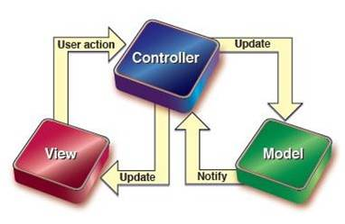

### newVue() 做了什么

初始化一个vue对象，

包含作用域代理、父子组件关系、钩子函数、组建通信等内部功能。

vm.$mount 挂载实例。

### 什么阶段才可以访问dom

beforeCreate钩子函数用来初始化inject、props、methods、data、computed、watch、provide等诸多功能

created实例化完成。在这里可以对data数据操作

而beforeMounted为模板编译之前

mounted时才可以访问dom，并对其操作。

### 生命周期

```
var LIFECYCLE_HOOKS = [
    'beforeCreate',
    'created',
    'beforeMount',
    'mounted',
    'beforeUpdate',
    'updated',
    'beforeDestroy',
    'destroyed',
    'activated',
    'deactivated',
    'errorCaptured',
    // v2.6+
    'serverPrefetch'
];
```

vue使用了一个函数来遍历常量数组，这个数组里存的就是各种钩子函数名

### serverPrefetch是什么

处理服务端渲染的异步数据，允许渲染时等待异步数据，可在任何组件中使用

### vue-router路由模式

三种hash（浏览器环境模式）、history、abstract（nodejs环境模式）

### keep-alive

ka可以使被包含的组件保留状态、或避免重新渲染。ka有两个新属性

> include：包含的组件。缓存
>
> exclude：派出的组件。不缓存。优先级大于include

ka是一个全局的抽象组件，通过自定义的rander函数且利用插槽来实现数据缓存和更新。

抽象组件不渲染真实DOM，且不会出现在父子关系的路径上。

### active-class是哪个组件的属性

vue-router模块的router-link组件，用来在导航栏中实现路由激活状态的显示

### 嵌套路由如何定义

children、redirect、相对路径或绝对路径（相对不带/）

### vue-router动态路由、如何获取动态参数？

1.params： /:id。this.$router.params.id

2.query： this.$router.push({name: a, query})（path与query是不能在一起使用）.this.$router.query.id

### vue-router导航钩子

第一种：是全局导航钩子：router.beforeEach(to,from,next)，作用：跳转前进行判断拦截。

第二种：组件内的钩子

第三种：单独路由独享组件

参数：to、from、next

### v-model是什么，怎么用，如何绑定

可以实现双向绑定（v-class、v-for、v-if、v-show、v-on）。vue的model层的data属性。绑定事件用@或v-bind，可以带修饰符

### axios怎么用，如何实现登陆功能

axios是一个异步调用接口的一个插件。下载好后，可以在js文件中创建axios方法设置30秒超时中断及请求拦截器和响应拦截器

> create axios1 = axios.create({timeout: 1000 * 30})
>
> instance.interceptors.request
>
> instance.interceptors.response

用于设置统一的token或其他header参数，响应拦截器用于统一的预处理接口响应，当服务响应失败或状态码异常，可以实现统一处理，401或403的时候清除token跳转登录页实现重新登录

### vuex是什么，怎么用

状态管理集

在main.js中引入store，通常有以下方法

> export const store= new vuex.store({
>
> ​	state: {},	//缓存值，私有模块
>
> ​	mutations； {}，//全局响应，set方法集
>
> ​	actions: {}, //和mutations差不多，不过可以异步调用
>
> ​	getters: {}, //全局响应，get方法集
>
> })

### mvvm框架是什么，他和DOM框架有什么区别

model+view+viewmodel

模型层和视图层，中间使用viewmodel连接，以响应式的通讯实现双向的数据绑定，本质就是set和watch

vue以数据驱动，通过数据来控制视图层的变化，而不是直接操作dom元素，在数据业务量大的情况下mvvm更加便捷。

mvp就是如此，

mvc中view是可以直接访问model的，



mtv模式本质与mvc没什么区别：

> model：数据对象
>
> template：模板
>
> view：视图，负责业务逻辑，并在适当时候调用model和template
>
> 另外django还有一个url分发器，用于将url请求分发给不同的view处理。view再调用相应的model和temlate，个人理解类似于C


### 自定义指令，它有哪些钩子函数，还有哪些钩子函数参数

vue对象的directive方法有两个参数，一个是指令名称，另一个是函数。

> ```xml
> 'focus',{
> 	//每当指令绑定到元素身上的时候,会立即执行这个bind函数,只执行一次
> 	bind(el){   
> 	//元素刚绑定了指令的时候,还没插入dom中,直接操作元素没用
> 	//只有元素插入到dom中时,才能获取焦点,写在inserted中
> 	//el.foucus();
> },
> ```

组件内定义指令：directives

钩子函数：bind（绑定事件触发）、inserted（节点插入时触发）、update（组件内相关更新）

### vue双向数据绑定的原理

vuejs采用数据劫持+发布者订阅者模式，通过Object.defineProperty()来劫持各个属性的setter、getter，在数据变动时发布消息给订阅者，触发相应的监听回调。

1. 将需要监听的数据对象递归遍历，包含子属性，都添加getter和setter属性
2. 解析模板，将变量替换为数据并渲染页面，并对每个节点绑定更新函数，添加监听数据的订阅者，当数据变动时，通过监听更新视图。
3. watcher订阅者是观察和编译的中间者，负责：
   1. 向订阅器中添加监听者
   2. 自身具有update()方法
   3. 当属性变动获取通知后，调用自身update()方法，并触发编译中绑定的回调函数。
4. MVVM作为数据绑定的入口，负责：
   1. 通过Observer监听自己model的变化
   2. 通过Compile解析编译模板
   3. 通过Watcher监听数据变化-->更新视图

### vue封装组件的过程

组件可以分为两种

1. 业务组件，为业务服务
2. 功能组件，为基本功能服务

vue.extend方法创建组件或直接export default{}暴露出来，

vue.component("abc", abc)全局注册或components{}局部注册

### vue-loader是什么，用途是什么？

是一个基于webpack的一个.vue文件加载器，可以将vue组件template、js、style转换成js模块。

### vue-cli项目中src目录中每个文件夹和文件的用途

vue-cli2

> assets：静态资源、会被压缩编译
>
> components：各类组件、业务组件和基础组件
>
> router：路由
>
> app.vue：应用主组件
>
> main.js：入口文件
>
> pages：业务页面

vue-cli3

> --

### vue.js的template编译的理解

先转化成AST树，render函数返回VNode（vue的虚拟DOM节点）


