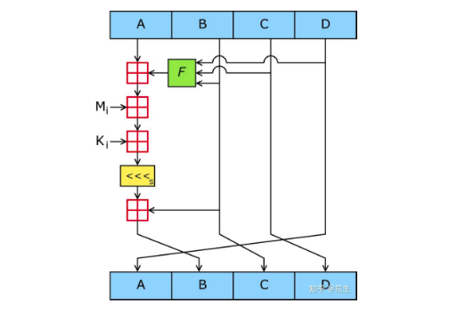

# MD5解析

##### [Essay](https://dixinl.github.io/Essay/)

## 讲一下Hash算法基础

哈希算法，也叫**散列算法**，指将任意数据创建体积更小的数字“指纹”的方法。

-   基本数学运算：
    -   直接取余法：f(x):= x mod maxM ; maxM一般是不太接近 2^t 的一个质数。
    -   乘法取整法：f(x):=trunc((x/maxX)*maxlongit) mod maxM，主要用于实数。*
    -   平方取中法：f(x):=(x*x div 1000 ) mod 1000000); 平方后取中间的，每位包含信息比较多。

哈希算法主要有MD5、SHA

1.  MD5 1991年 输出128位 （已经不安全）
2.  SHA-0 1993年 输出160位 （发布之后很快就被NSA撤回，是SHA-1的前身）
3.  SHA-1 1995年 输出160位 （已经不安全）
4.  SHA-2包括SHA-224、SHA-256、SHA-384，和 SHA-512，分别输出224、256、384、512位。 (目前安全)

-   冲突避免：
    -   2的128次方为340282366920938463463374607431768211456，也就是10的39次方级别
    -   2的160次方为1.4615016373309029182036848327163e+48，也就是10的48次方级别
    -   2的256次方为1.1579208923731619542357098500869 × 10的77次方，也就是10的77次方

宇宙中**原子数大约在10的60次方到80次方之间**，所以2的256次方有足够的空间容纳所有的可能，算法好的情况下冲突碰撞的概率很低。

## MD5的算法

--MD5使用Hash算法--，将4×32位的结果拼接为128位（16字节）的散列值。**散列值不同，原数据必不相同。但散列值相同，原数据也有可能不同，所以无法防止散列碰撞。**

如下为MD5算法逻辑：

1.  数据填充，将数据填充至**512×X+448位，填充项第一位为1，后面都是0**

2.  添加**消息长度，该长度为固定64位**，最后得出的结果为512×X位的字符串

    

3.  数据处理

    -   4个常数

        >   A = 0x67452301
        >
        >   B = 0x0EFCDAB89
        >
        >   C = 0x98BADCFE
        >
        >   D = 0x10325476

    -   4个函数

        >   F(X,Y,Z)=(X & Y) | ((~X) & Z);
        >
        >   G(X,Y,Z)=(X & Z) | (Y & (~Z));
        >
        >   H(X,Y,Z)=X ^ Y ^ Z;
        >
        >   I(X,Y,Z)=Y ^ (X | (~Z)); 

        

    把消息分**以512位为一分组进行处理，每一个分组进行4轮变换，以上面所说4个常数为起始变量进行计算，重新输出4个变量，以这4个变量再进行下一分组的运算**，如果已经是最后一个分组，则这4个变量为最后的结果，即MD5值。