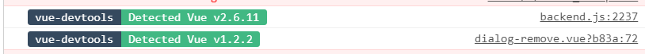

# 编译成功

##### [Essay](https://dixinl.github.io/Essay/)

> ```
> 
> ```


> ```
> console.log(
>           `%c vue-devtools %c Detected Vue v1.2.2 %c`,
>           "background:#35495e ; padding: 1px; border-radius: 3px 0 0 3px;  color: #fff",
>           "background:#41b883 ; padding: 1px; border-radius: 0 3px 3px 0;  color: #fff",
>           "background:transparent"
>         );
> ```



