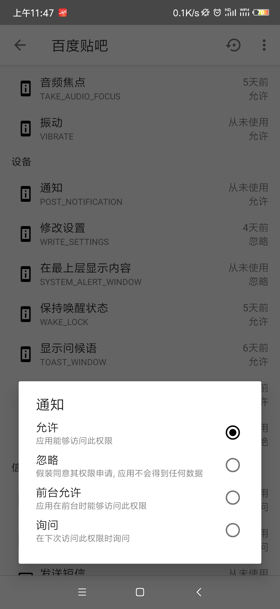
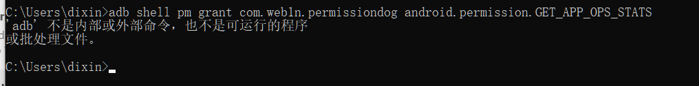
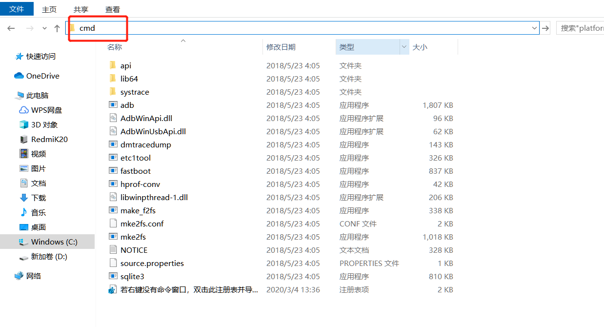

# Android 绕过权限访问

##### [Essay](https://dixinl.github.io/Essay/)

## Appops 权限

在 Android 系统中存在一个叫做 **appops** 的系统服务，该服务定义了一系列的应用操作。其中部分应用操作与权限对应（如 OP_CAMERA 与相机权限）。

原生 Android 系统使用 appops 来追踪权限使用，appops 也部分被用于权限控制。每个应用都有自己的 appops 设置，当应用需要执行某些操作时，系统在检查权限的同时也会检查 appops 设置。

与我们现在看到的允许和禁止不同，实际上 appops 中还有一个忽略选项，**当权限设置为忽略时，应用将无法获取权限，依然能够正常运行。**

然而遗憾的是，Google 在 Android 4.4.2 开始移除了 appops 的设置入口，从此用户不再能自己调整每个应用的 appops 设置。

虽然 Google 移除了 appops 的设置入口，但本身 appops 服务依然存在于 Android 系统中，我们可以通过一些第三方软件来管理这些设置。

## 材料

*注：本操作适用于非 root 用户，如已 root 成功，请退出。*

### 硬件

- Redmi K20 一台
- PC机一台

### 软件

- **权限狗**，**AppOps**均可

## 操作

1. 手机 -> 开发者权限 -> USB调试 -> USB调试（安全模式）

2. 连接至电脑，打开CMD

3. 执行

   > adb shell pm grant com.web1n.permissiondog android.permission.GET_APP_OPS_STATS

   获取手机AppOps权限

4. 执行

   > adb shell sh /storage/emulated/0/Android/data/com.web1n.permissiondog/files/starter.sh

   执行操作

5. 此时已经获取到了对软件修改 appops 权限的功能，点击权限，会有一个忽略选项

   

   忽略即可用来绕过流氓软件的强制获取隐私。

6. 若3无法执行

需安装Google 官方 ADB 工具包 链接：https://pan.baidu.com/s/1oJRRzzi5rOcYDDBHnLu4Bw 提取码：cmz7

随便解压到什么地方

接着执行步骤 3 即可。

## 写在后面

1. 该教程为 adb 一次性操作，每次重启后仍需重复上述步骤，但安全性高。
2. 如果手机是单系统且应用无双开，可以使用 IceBox、小黑屋、Shizuku 等软件实现永久操作的权限

- Shizuku 使用

  - 操作如上，adb输入

    > adb shell sh /sdcard/Android/data/moe.shizuku.privileged.api/files/start.sh

    即可获取权限，可以把这些权限授权给具体管理软件来使用。
