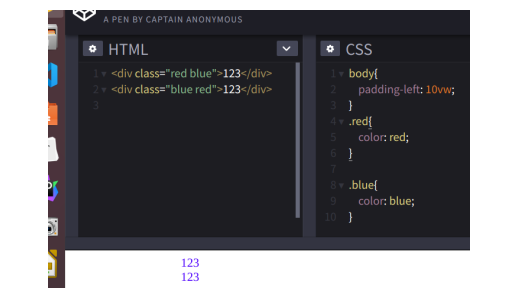

# CSS权重计算规则

## 权重值计算

| 选择器                         | 案例          | 权重值   |
| ------------------------------ | ------------- | -------- |
| !important                     | !important    | Infinity |
| 内联样式                       | style=".."    | 1000     |
| ID                             | #id           | 100      |
| class                          | .class        | 10       |
| 属性                           | [type='text'] | 10       |
| 伪类                           | :hover        | 10       |
| 标签                           | p             | 1        |
| 伪元素                         | ::first-line  | 1        |
| 相邻选择器、子代选择器、通配符 | * > +         | 0        |

## 比较规则

-   1000>100。也就是说从左往右逐个等级比较，前一等级相等才往后比。
-   在权重相同的情况下，后面的样式会覆盖掉前面的样式。
-   继承属性没有权重值
-   通配符、子选择器、相邻选择器等的。虽然权值为0，但是也比继承的样式优先。
-   ie6以上才支持`!important`，并且尽量少用它。

## 坑

这道题去年推特上一个大神发的，几千个人只有一半人对。。。

两个123颜色是啥？

>   ```css
>   >   <div class="red blue">123</div>
>   >   <div class="blue red">123</div>
>   >
>   >   .red {
>   >     color: red;
>   >   }
>   >   .blue {
>   >     color: blue
>   >   }
>   ```

### 答案

​	都是蓝色

>   -   障眼法
>   -   css计算规则和class先后顺序无关
>   -   css加载顺序由上至下，并以此渲染文件

