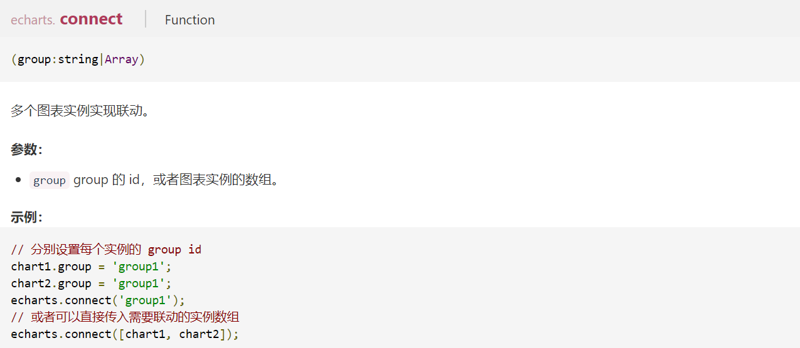

# ECharts 笔记 分组篇

## 实现：

|  使用   |                                      |
| :-----: | :----------------------------------: |
| connect |                 方法                 |
|  group  | echartsInstance: echarts.init 的实例 |

[echarts 联动 演示](https://dixinl.github.io/Essay/example/echarts-connect/index.html)

