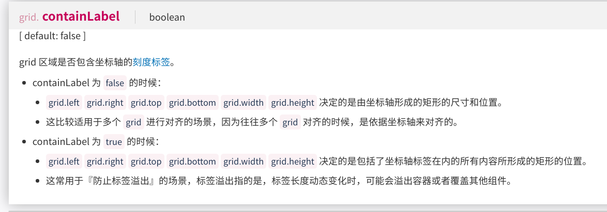
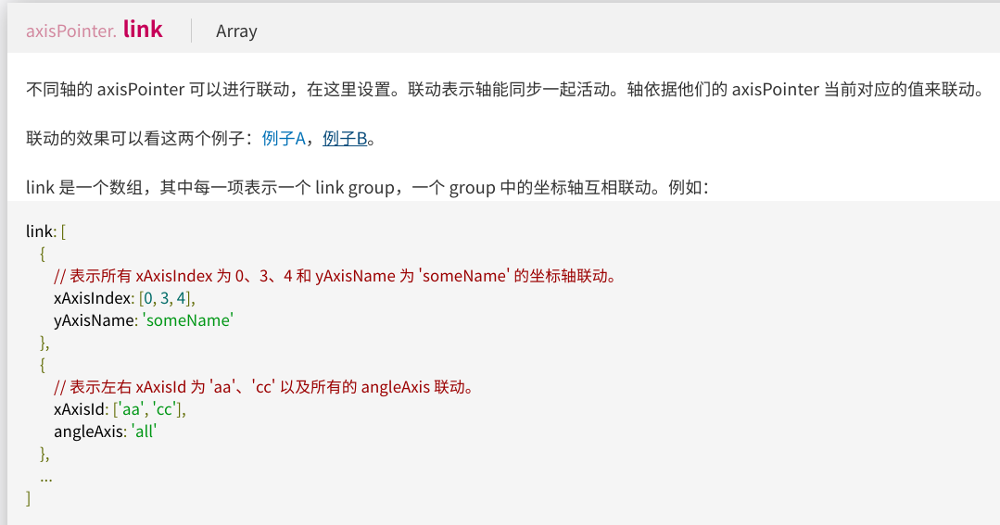
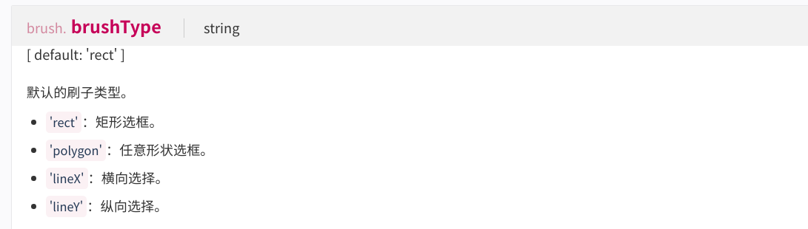

# ECharts 笔记

##### [Essay](https://dixinl.github.io/Essay/)

## grid 网格

### grid 中的 containLabel 属性

>   true/false 包括所有内容形成的矩形 / 不包括...

## axisPointer 坐标轴指示器

### axisPointer 中的 link 属性

>   link 是一个数组
>
>   link.group中定义坐标轴联动

## brush 区域选择组件

### brush 中的brushType

