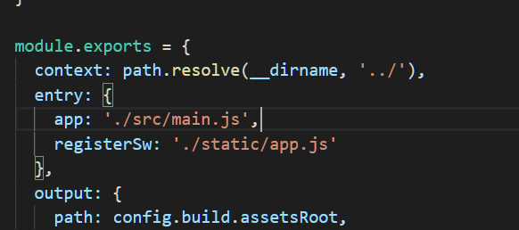
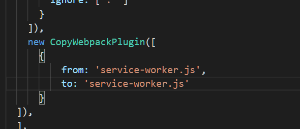

# PWA 关于 vue2 实战

##### [Essay](https://dixinl.github.io/Essay/)

- 无论是移动端还是 pc 端中 webApp 的建立，主要都依靠两个文件

1. sw.js：PWA中重点 ServiceWorker 脚本文件，注册时通过 register() 方式注册

   > navigator.serviceWorker.register('/service-worker.js').then((swReg) => {
   >
   > ​            console.log('Registration successful');
   >
   > ​            swRegistration = swReg;
   >
   > ​            if (isSubscribe) {
   >
   > ​                unsubscribeUser();
   >
   > ​            } else {
   >
   > ​                subscribeUser();
   >
   > ​            }
   >
   > ​        }).catch((error) => {
   >
   > ​            console.error('Service Worker Error', error);
   >
   > ​        });
   >
   > };

2. manifest.json：在终端建立快捷方式的配置清单及最佳图标选项，图标格式至少有一个为 image/png 格式

**注： manifest.json与service-worker.js文件需要与index.html文件保持在同一目录或更高级的目录里**

## 操作

1. 用到三个文件

   - app.js
   - service-worker.js
   - manifest.json

2. app.js 文件 （主要用来注册 sw）

   > let swRegistration = null;
   >
   > let isSubscribe = false;
   >
   > const applicationServerPublicKey = 'BO_R6m8osilNmdOhEHk-KF0o1u-EPruOL1bDaISHwDwSLacPsh35Hg41nZpS00XeCLG-KbGEqx35x6PKsdZNVCk';
   >
   > (() => {
   >
   > ​    if ('serviceWorker' in navigator && 'PushManager' in window) {
   >
   > ​        navigator.serviceWorker.register('service-worker.js').then((swReg) => {
   >
   > ​            console.log('Registration successful');
   >
   > ​            swRegistration = swReg;
   >
   > ​            if (isSubscribe) {
   >
   > ​                unsubscribeUser();
   >
   > ​            } else {
   >
   > ​                subscribeUser();
   >
   > ​            }
   >
   > ​        }).catch((error) => {
   >
   > ​            console.error('Service Worker Error', error);
   >
   > ​        });
   >
   > ​    } else {
   >
   > ​        console.warn('Push messaging is not supported');
   >
   > ​    }
   >
   > })();
   >
   > 
   >
   > ​    const padding = '='.repeat((4 - base64String.length % 4) % 4);
   >
   > ​    const base64 = (base64String + padding)
   >
   > ​      .replace(/\-/g, '+')
   >
   > ​      .replace(/_/g, '/');
   >
   > ​    const rawData = window.atob(base64);
   >
   > ​    const outputArray = new Uint8Array(rawData.length);
   >
   > ​    for (let i = 0; i < rawData.length; ++i) {
   >
   > ​        outputArray[i] = rawData.charCodeAt(i);
   >
   > ​    }
   >
   > ​    return outputArray;
   >
   > }
   >
   > 
   >
   > function subscribeUser () {
   >
   > ​    const applicationServerKey = urlB64ToUint8Array(applicationServerPublicKey);
   >
   > ​    swRegistration.pushManager.subscribe({
   >
   > ​        userVisibleOnly: true,
   >
   > ​        applicationServerKey: applicationServerKey
   >
   > ​    }).then((subscription) => {
   >
   > ​        console.log('user is subscribed:', JSON.stringify(subscription));
   >
   > ​        isSubscribe = true;
   >
   > ​        updateBtn();
   >
   > ​    }).catch((err) => {
   >
   > ​        console.log('failed to subscribe', err);
   >
   > ​    });
   >
   > }
   >
   > 
   >
   > function unsubscribeUser () {
   >
   > ​    swRegistration.pushManager.getSubscription().then((subscription) => {
   >
   > ​        if (subscription) {
   >
   > ​            return subscription.unsubscribe();
   >
   > ​        }
   >
   > ​    }).catch((err) => {
   >
   > ​        console.log('err unsubscribe', err);
   >
   > ​    }).then(() => {
   >
   > ​        console.log('user is unsubscribed');
   >
   > ​        isSubscribe = false;
   >
   > ​        updateBtn();
   >
   > ​    })
   >
   > }
   >
   > 
   >
   > function updateBtn () {
   >
   > ​    if (isSubscribe) {
   >
   > ​        console.log("sw success")
   >
   > ​    } else {
   >
   > ​        console.log("sw error")
   >
   > ​    }
   >
   > }

3. 将 app.js 文件打包，注入到生成的 index.html 中

   修改 webpack.base.conf.js 配置文件中 entry

   > entry: {
   >
   > ​        app: './src/main.js',
   >
   > ​        registerSw: './scripts/app.js'
   >
   > ​    },

   

   修改该文件下 plugins 参数
   
   > // 复制 pwa 所需的文件到 输出的地方
   >
   > ​    new CopyWebpackPlugin([
   >
   > ​        {
   >
   > ​            from: 'service-worker.js',
   >
   > ​            to: 'service-worker.js'
   >
   > ​        },
   >
   > ​        {
   >
   > ​            from: 'manifest.json',
   >
   > ​            to: 'manifest.json'
   >
   > ​        }
>
   > ​    ])

   
   
   copy-webpack-plugin 插件用于打包时复制文件
   
   **注：以上步骤相对简单，唯一困扰的地方就是路径问题，路径配对了，PWA 就相当于完成了八成**

 

 

 