# Transfolw.js loss 篇

##### [Essay](https://dixinl.github.io/Essay/)

## 机器学习

解决一个机器学习问题主要有两部分：数据和算法。而算法又有三个部分组成：假设函数、损失函数、算法优化。

本篇文章重点讲解 loss 损失函数

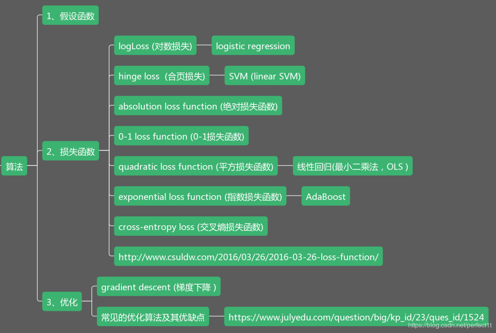

## loss 细分

### 分类任务 loss

#### 二分类交叉熵损失 sigmoid_cross_entropy

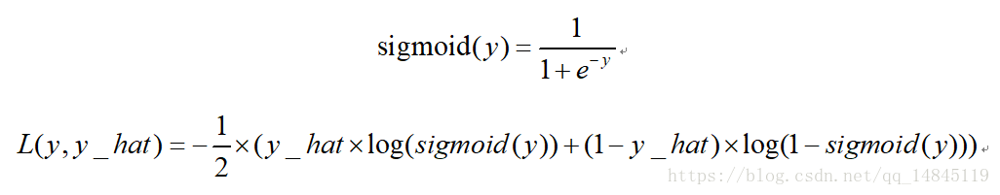

#### 二分类平衡交叉熵损失 balanced_sigmoid_cross_entropy

该损失也是用于 2 分类的任务，相比于 sigmoid_cross_entrop 的优势在于引入了平衡参数 ，可以进行正负样本的平衡，得到比 sigmoid_cross_entrop 更好的效果。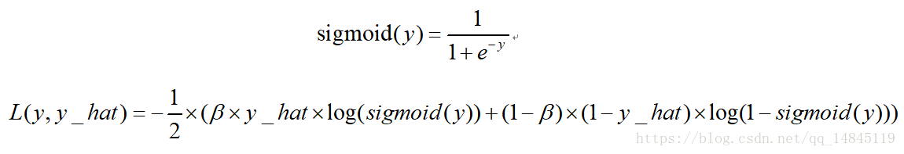

#### 多分类交叉熵损失 softmax_cross_entropy

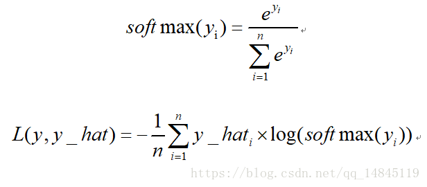

#### focal loss

focal loss 主要用于解决多分类任务中样本不平衡的现象，可以获得比 softmax_cross_entropy 更好的分类效果。

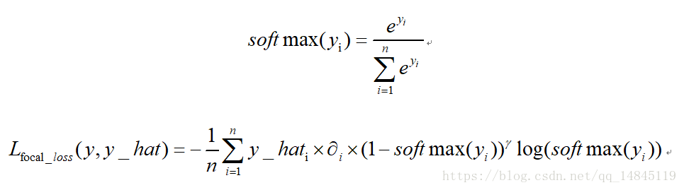

理论上 α=0.25，γ=2 时效果最好。

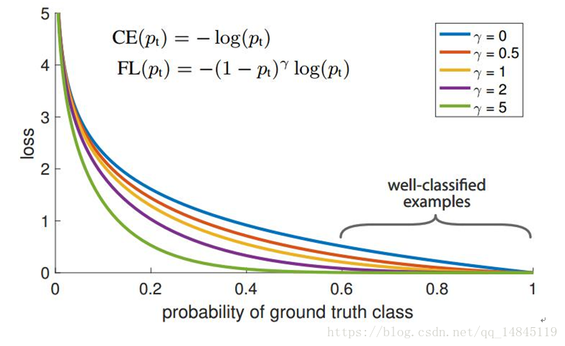

#### dice loss

二分类任务时使用的 loss，本质就是不断学习，使得交比并越来越大。

#### 合页损失 hinge_loss

也叫铰链损失，是 svm 中使用的损失函数。

由于合页损失优化到满足小于一定 gap 距离就会停止优化，而交叉熵损失却是一直在优化，所以，通常情况下，交叉熵损失效果优于合页损失。

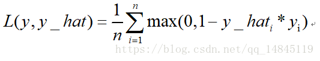

#### Connectionisttemporal classification(ctc loss)

对于预测的序列和 label 序列长度不一致的情况下，可以使用 ctc 计算该 2 个序列的 loss，主要用于文本分类识别和语音识别中。

#### 编辑距离 edit loss

编辑距离，也叫莱文斯坦 Levenshtein 距离，指的是两个字符串之间，由一个转换成另一个所需的最少编辑操作次数。许可的编辑操作包括将一个字符替换成另一个字符，插入一个字符，删除一个字符。
该损失函数的优势在于类似于 ctc loss 可以计算2个长度不等的序列的损失。

#### KL 散度

KL 散度 ( Kullback–Leibler divergence)，也叫相对熵，是描述两个概率分布 P 和 Q 差异的一种方法。它是非对称的，这意味着 D(P||Q) ≠ D(Q||P)。特别的，在信息论中，D(P||Q) 表示当用概率分布 Q 来拟合真实分布P时，产生的信息损耗，其中 P 表示真实分布，Q 表示 P 的拟合分布。

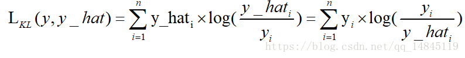

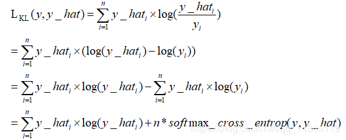

从上面式子可以看出，kl 散度，也就是相对熵，其实就是交叉熵 + 一个常数项。

#### 最大间隔损失 large margin softmax loss

用于拉大类间距离的损失函数，可以训练得到比传统 softmax loss 更好的分类效果。

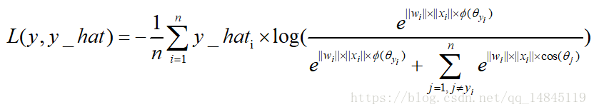

最大间隔损失主要引入了夹角 cos 值进行距离的度量。假设 bias 为 0 的情况下，就可以得出如上的公式。

其中 fai(seita) 需要满足下面的条件。

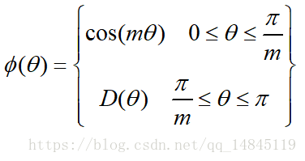

为了进行距离的度量，在 cos 夹角中引入了参数 m。该m为一个正整数，可以起到控制类间间隔的作用。M 越大，类间间隔越大。当 m=1 时，等价于传统交叉熵损失。基本原理如下面公式

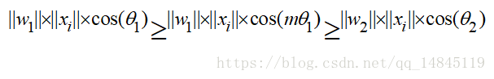

论文中提供的满足该条件的公式如下

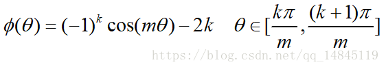

#### 中心损失center loss

中心损失主要主要用于减少类内距离，虽然只是减少了类内距离，效果上却可以表现出类内距离小了，类间距离就可以增大的效果。该损失不可以直接使用，需要配合传统的softmax loss一起使用。可以起到比单纯softmax loss更好的分类效果。

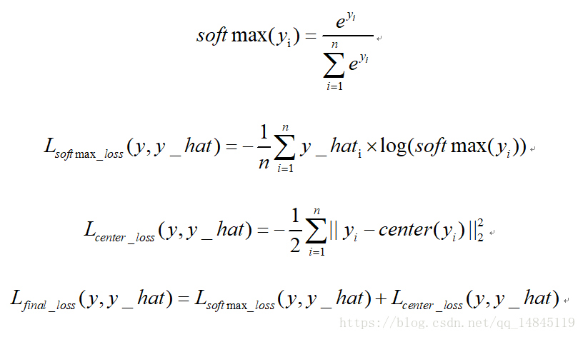

### 回归任务loss

#### 均方误差 mean squareerror（MSE）和 L2 范数

MSE 表示了预测值与目标值之间差值的平方和然后求平均

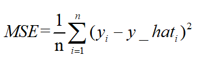

L2 损失表示了预测值与目标值之间差值的平方和然后开更方，L2 表示的是欧几里得距离。

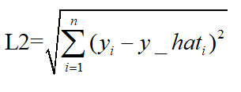

MSE 和 L2 的曲线走势都一样。区别在于一个是求的平均 np.mean()，一个是求的平方根 np.sqrt()

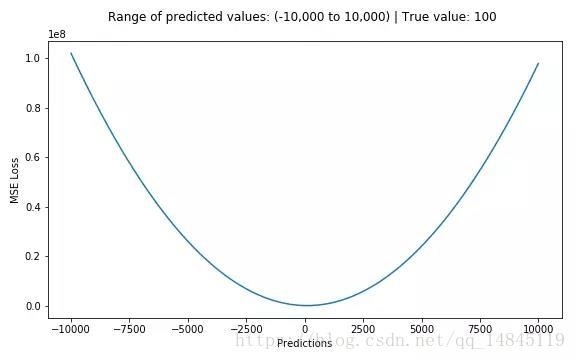

#### 平均绝对误差 meanabsolute error(MAE )和 L1 范数

MAE 表示了预测值与目标值之间差值的绝对值然后求平均

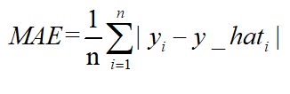

L1 表示了预测值与目标值之间差值的绝对值，L1 也叫做曼哈顿距离

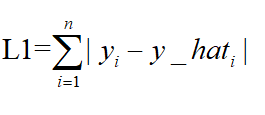

MAE 和 L1 的区别在于一个求了均值 np.mean()，一个没有求 np.sum()。二者的曲线走势也是完全一致的。

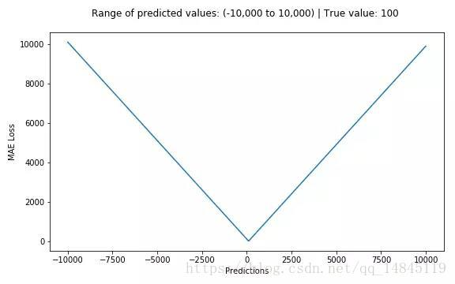

##### MSE，MAE对比：

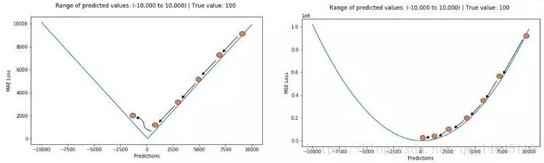

MAE 损失对于局外点更鲁棒，但它的导数不连续使得寻找最优解的过程低效；MSE 损失对于局外点敏感，但在优化过程中更为稳定和准确。

#### Huber Loss 和 smooth L1

Huber loss 具备了 MAE 和 MSE 各自的优点，当 δ 趋向于 0 时它就退化成了 MAE，而当 δ 趋向于无穷时则退化为了 MSE。

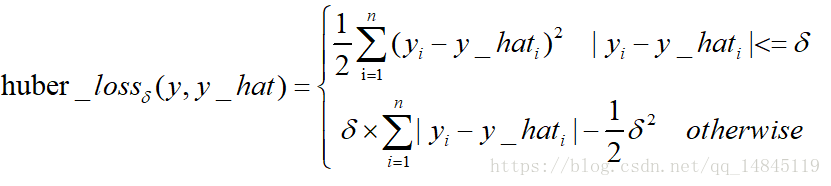

Smooth L1 loss 也具备了 L1 loss 和 L2 loss 各自的优点，本质就是 L1 和 L2 的组合。

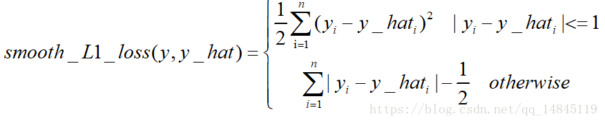

Huber loss 和 Smooth L1 loss 具有相同的曲线走势，当 Huber loss 中的 δ 等于 1 时，Huber loss 等价于 Smooth L1 loss。

对于 Huber 损失来说，δ 的选择十分重要，它决定了模型处理局外点的行为。当残差大于 δ 时使用 L1 损失，很小时则使用更为合适的 L2 损失来进行优化。

Huber 损失函数克服了 MAE 和 MSE 的缺点，不仅可以保持损失函数具有连续的导数，同时可以利用 MSE 梯度随误差减小的特性来得到更精确的最小值，也对局外点具有更好的鲁棒性。

但 Huber 损失函数的良好表现得益于精心训练的超参数 δ。

#### 对数双曲余弦 logcosh

其优点在于对于很小的误差来说 log(cosh(x)) 与 (x**2)/2 很相近，而对于很大的误差则与 abs(x)-log2 很相近。这意味着 logcosh 损失函数可以在拥有 MSE 优点的同时也不会受到局外点的太多影响。它拥有 Huber 的所有优点，并且在每一个点都是二次可导的。

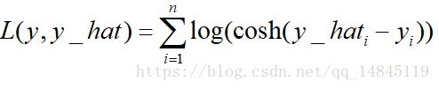

